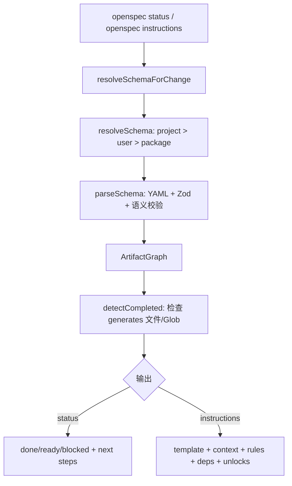

# 调查沉淀：OpenSpec × Custom Schemas × Trae(含Trae SOLO) × Superpowers

更新时间：2026-05-20  
范围：本工作区对 OpenSpec 项目本体、OpenSpec custom schema 机制、openspec-schemas(superpowers-bridge)、以及在 Trae/Trae SOLO 下的手动集成方式的调查结论。

## 1. 结论摘要

- OpenSpec 的核心交付物是 `openspec` CLI（负责生成/校验/查询 workflow artifacts），以及一套可被各类 coding agent 工具加载的 Skills/Commands 文件生成机制。
- OpenSpec 的 “Custom Schemas” 是把工作流定义为 `schema.yaml + templates/`，并通过 “依赖图（DAG）+ 文件存在性探测” 推导每个 artifact 的状态（done/ready/blocked），从而驱动 `openspec status` 与 `openspec instructions`。
- OpenSpec 已支持 Trae 的 Skills 安装（输出到 `.trae/skills/openspec-*/SKILL.md`），但官方未提供 Trae 的 Commands 文件适配器，因此不会自动生成 `opsx-*` 命令文件；可通过 Trae Settings 的 Commands UI 手动创建命令以获得同等快捷入口。
- `openspec-schemas/superpowers-bridge` 是一个典型的 custom schema bundle：它不修改 OpenSpec CLI，也不修改 Superpowers 源码，通过 schema 的 prompt/instruction 约束实现“输出重定向、技能编排、apply 门槛、verify/retro 闭环”等流程整合。
- Superpowers 在 Claude Code 上有官方 plugin 安装路径；在 Trae/Trae SOLO 的可行路径是“导入/创建 Skills”（具体导入方式取决于 Trae 的技能加载机制与 UI 能力）。

## 2. OpenSpec 运作方式（产物与安装）

### 2.1 OpenSpec 的两类“产物”

1) 发布物（OpenSpec 自身提供）

- `openspec` CLI：入口文件 [openspec.js](file:///workspace/bin/openspec.js)；源码入口 [cli/index.ts](file:///workspace/src/cli/index.ts) / [index.ts](file:///workspace/src/index.ts)

2) 生成物（在目标项目/目标工具环境里落地）

- 项目内 `openspec/` 目录（specs、changes、config 等）
- 工具侧 Skills/Commands 文件（由 `openspec init/update` 写入工具约定目录）

### 2.2 安装/生成的关键逻辑（init/update）

- `openspec init` 会在项目根创建 `openspec/` 基础目录结构，并根据 `--tools` 与 delivery 策略，生成 Skills 与（部分工具）Commands。
- Commands 是否生成取决于是否存在 tool adapter：`CommandAdapterRegistry.get(toolId)` 为真才会生成，否则加入 `commandsSkipped`。

关键实现位置：

- 生成 Skills/Commands 的核心逻辑：[init.ts](file:///workspace/src/core/init.ts#L494-L592)
- Command adapter registry：[registry.ts](file:///workspace/src/core/command-generation/registry.ts#L39-L70)

## 3. Custom Schemas 的原理（OpenSpec 的 schema 驱动机制）

### 3.1 Schema 的组成

schema 目录结构（项目级 custom schema）：

```text
openspec/schemas/<schema-name>/
├── schema.yaml
└── templates/
    └── *.md
```

字段含义（概念层）详见：[customization.md](file:///workspace/docs/customization.md#L94-L199)

### 3.2 Schema 如何“驱动工作流”（依赖图 + 文件存在性）

OpenSpec 将 schema 解析为 artifact DAG，并通过 `generates` 对应文件是否存在来推导完成态。

核心链路（代码）：

- schema 结构与校验： [types.ts](file:///workspace/src/core/artifact-graph/types.ts) / [schema.ts](file:///workspace/src/core/artifact-graph/schema.ts)
- 解析/加载位置覆盖规则（project/user/package）：[resolver.ts](file:///workspace/src/core/artifact-graph/resolver.ts#L48-L153)
- 依赖图查询（build order、ready、blocked）：[graph.ts](file:///workspace/src/core/artifact-graph/graph.ts#L68-L166)
- 输出文件探测（支持 glob）：[outputs.ts](file:///workspace/src/core/artifact-graph/outputs.ts#L17-L35)
- completed 集合推导：[state.ts](file:///workspace/src/core/artifact-graph/state.ts#L14-L28)
- status 汇总（done/ready/blocked + applyRequires）：[instruction-loader.ts](file:///workspace/src/core/artifact-graph/instruction-loader.ts#L488-L548)
- instructions 注入（template + context + rules + deps + unlocks）：[instruction-loader.ts](file:///workspace/src/core/artifact-graph/instruction-loader.ts#L275-L342)

示意图（概念）：



## 4. openspec-schemas：superpowers-bridge 的工作原理与问题动机

本工作区已克隆：

- openspec-schemas（自定义 schema 仓库）：[openspec-schemas](file:///workspace/openspec-schemas)
- 关注目录： [superpowers-bridge](file:///workspace/openspec-schemas/superpowers-bridge)

### 4.1 它是什么

superpowers-bridge 是一个 OpenSpec custom schema bundle，用 prompt 层把：

- OpenSpec 的 “artifact 治理/推进”（what）
- Superpowers 的 “工程化执行技能”（how）

编排成同一条 workflow，并新增 evidence-first 的 `retrospective` artifact 作为闭环补齐。

来源： [superpowers-bridge README](file:///workspace/openspec-schemas/superpowers-bridge/README.md#L10-L13)

### 4.2 它解决什么问题（动机）

superpowers-bridge 明确试图解决三个结构性问题：

- 输出重复：Superpowers 默认写到 `docs/superpowers/...`，OpenSpec 又在 change 目录维护 proposal/design/tasks，内容重叠与漂移
- 任务碎片化：OpenSpec 的 tasks（粗粒度）与 Superpowers 的 plan（微步骤）并行存在且难统一
- 手动编排成本：用户每一步都要决定用哪个技能/命令，系统缺乏联动

来源： [superpowers-bridge README](file:///workspace/openspec-schemas/superpowers-bridge/README.md#L121-L137)

### 4.3 它怎么做（关键机制）

- 在 schema.yaml 的 artifact instructions 中写入 “PRECHECK + 必须调用的 skill + 输出重定向规则”，例如：
  - `brainstorm`：要求调用 `superpowers:brainstorming`，并把产出写到 change 的 `brainstorm.md`，禁止写到 `docs/superpowers/specs/`
  - `plan`：要求调用 `superpowers:writing-plans`，并把产出写到 change 的 `plan.md`，禁止写到 `docs/superpowers/plans/`
- 将 apply 门槛改为 `apply.requires: [plan]`，以确保进入实施前已经有微步骤计划
- 增加 `verify` 与 `retrospective`，在 apply 后做验证与复盘闭环（并加入“前门绕行泄漏检测”）

来源：

- schema： [schema.yaml](file:///workspace/openspec-schemas/superpowers-bridge/schema.yaml)
- verify 模板： [verify.md](file:///workspace/openspec-schemas/superpowers-bridge/templates/verify.md)
- retro 模板： [retrospective.md](file:///workspace/openspec-schemas/superpowers-bridge/templates/retrospective.md)

## 5. Trae / Trae SOLO：OpenSpec commands 的手动创建推导

### 5.1 为什么 OpenSpec 不自动生成 Trae commands 文件

- OpenSpec 的 commands 生成依赖 `CommandAdapterRegistry` 中存在对应 tool adapter；不存在就跳过生成（但仍可生成 skills）。
- Trae 在工具列表中存在，但 registry 中没有 trae adapter，因此不会产出 `opsx-*` 文件。

关键链路：

- init 阶段 adapter 判断与跳过逻辑：[init.ts](file:///workspace/src/core/init.ts#L553-L566)
- registry 中缺失 trae adapter：[registry.ts](file:///workspace/src/core/command-generation/registry.ts#L39-L70)

### 5.2 手动 commands 的推荐策略（UI 创建 wrapper）

在 Trae 的 Commands UI 中创建 commands，内容采用 “薄封装”：

- 命令只负责 “调用已安装的 openspec skill”
- 具体流程由 skill（SKILL.md）指导执行

建议创建（Project scope）：

- `openspec-propose` → 调用 `openspec-propose`
- `openspec-continue` → 调用 `openspec-continue-change`
- `openspec-apply` → 调用 `openspec-apply-change`
- `openspec-sync` → 调用 `openspec-sync-specs`
- `openspec-archive` → 调用 `openspec-archive-change`

补充：OpenSpec 内置的 tool-agnostic command 正文模板在 [shared/skill-generation.ts](file:///workspace/src/core/shared/skill-generation.ts#L108-L118) 生成；各 workflow 模板例如：

- propose：[propose.ts](file:///workspace/src/core/templates/workflows/propose.ts#L119-L225)
- apply：[apply-change.ts](file:///workspace/src/core/templates/workflows/apply-change.ts#L167-L260)
- sync：[sync-specs.ts](file:///workspace/src/core/templates/workflows/sync-specs.ts#L155-L240)

## 6. Superpowers：安装方式与 Trae/Trae SOLO 的可行路径

本工作区已克隆 superpowers 仓库用于核对安装方式与技能目录结构：

- [third_party_superpowers](file:///workspace/third_party_superpowers)

### 6.1 Claude Code（参考）

Superpowers 在 Claude Code 支持通过插件安装，例如：

- `/plugin install superpowers@claude-plugins-official`

来源（仓库 README）：[third_party_superpowers/README.md](file:///workspace/third_party_superpowers/README.md#L35-L61)

### 6.2 Trae / Trae SOLO（可行路径：导入 Skills）

由于 Trae 具备 Skills 概念与 UI（可创建/开启扫描目录），而 Superpowers 的核心资产是 `skills/*/SKILL.md`，因此可行路径是：

- 只导入“Trae 内置缺失”的 superpowers skills（避免与内置 skills 重名冲突）
- 将 superpowers 的 `skills/<skill>/SKILL.md` 内容导入/粘贴到 Trae 的 Skill 创建流程中，或通过 Trae 的 skills directory 扫描机制加载

示例 skill 文件（superpowers brainstorming）：[SKILL.md](file:///workspace/third_party_superpowers/skills/brainstorming/SKILL.md)

## 7. 未决问题（后续如需继续）

- Trae commands 的“可导出文件格式/批量导入机制”是否存在（目前仅确认 UI 概念存在）
- Trae 对 skills 的命名冲突处理策略（同名覆盖/并存/命名空间前缀）与最佳实践
- 若要让 OpenSpec 原生生成 Trae commands，需要 Trae 的“命令落盘路径/格式”规范，进而实现 `traeAdapter`（类似 [antigravityAdapter](file:///workspace/src/core/command-generation/adapters/antigravity.ts)）

